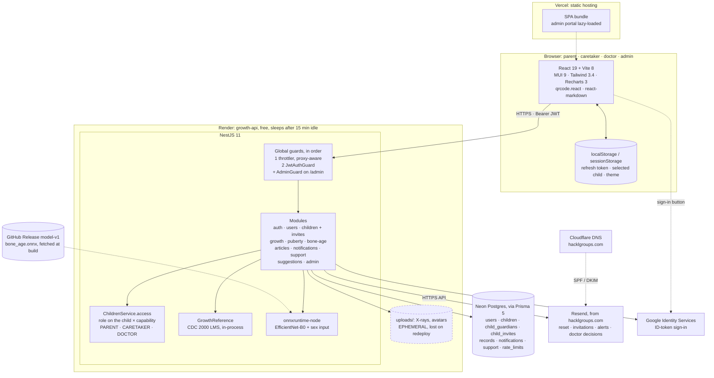
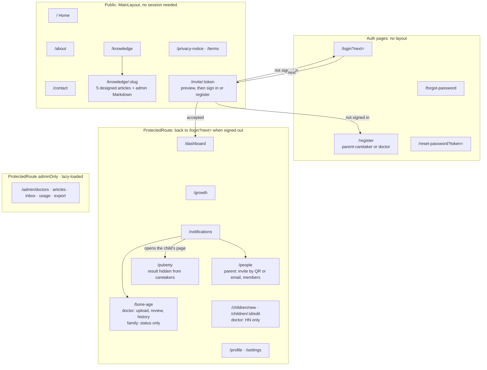

# GrowTH — System Diagrams

Mermaid source for the project diagrams. They describe the system **as built in
`studio5-beta`** (updated 2026-10-01): the team's frontend, the NestJS backend, and the parent,
caretaker, doctor and admin roles the client asked for on 2026-09-30.

| Diagram | Where |
| --- | --- |
| System architecture | §1 below · export [`diagram-system-architecture.svg`](./diagram-system-architecture.svg) |
| App structure (routes) | §2 below · export [`diagram-app-structure.svg`](./diagram-app-structure.svg) |
| User flows, one per role, and the invitation sequence | [`user-flows.md`](./user-flows.md) · exports in [`user-flows/`](./user-flows/) |

> The SVG exports in this folder still show the August build. Regenerate them from this file
> (see the end) before using them in slides; GitHub renders the Mermaid below directly.

---

## 1. System Architecture



**Notes on what this shows**

- **Two kinds of role.**
  - The account role (`USER`, `DOCTOR`, `ADMIN`) gates the admin portal. It also gates whether a doctor is approved.
  - The role on each child (`PARENT`, `CARETAKER`, `DOCTOR`, on `child_guardians`) decides everything else.
  - Every child route goes through `ChildrenService.access`, which checks one capability table (`backend/src/children/child-access.ts`).
  - Responses are shaped per role on the server, so a caretaker's browser never receives a puberty result and a family's never receives the bone-age months.
- **Auth.**
  - A 15-minute access JWT is kept in memory.
  - The refresh token is random, stored SHA-256-hashed in `sessions`, and rotated on every use.
  - A password reset or change revokes every session.
  - `AdminGuard` reads the role from the database on each request, so a demotion takes effect at once.
- **Invitations.** A parent creates one, and the link carries a random token stored only as a hash. It is single-use, expires in 7 days, and can be shared as a QR code or by email through Resend. The claim is transactional.
- **Guard order matters.** The throttler runs before `JwtAuthGuard`, so a credential flood is rejected before it costs a verify or a bcrypt compare. The counters live in Postgres because Render can run more than one instance.
- **One service.** Inference runs inside the API through `onnxruntime-node`. Render's free hours are per workspace, so a second service would burn them twice as fast and add a second cold start. The model is a release asset, not in git. See [`model-updates.md`](./model-updates.md).
- **The dashed box is the remaining gap.** Render's disk does not survive a redeploy, so X-rays are lost while their rows remain. Doctors now keep an X-ray history, which makes this matter more. Cloudflare R2's free tier is the low-cost fix (`tor-compliance.md` §5).
- **Calibration is still provisional.** `AGE_MEAN`/`AGE_STD` were derived, not supplied, and every estimate says so.

---

## 2. App structure: routes and layout



**Notes**

- **The child switcher is shared.**
  - Each signed-in page starts with the same child card, and the selected child is kept across reloads.
  - Caretakers see their children grouped by family.
  - Doctors can also search by HN.
- **One route serves several roles.** `/bone-age` and `/puberty` render a different view for each role. The server decides what data each view receives; the page does not filter it.
- **Notifications are links.** Each one selects its child and opens the page it is about.
- "Report a problem" lives in the profile menu on every signed-in page. It sends the current page with the message.

---

## Rendering these

GitHub renders Mermaid in Markdown natively. For standalone files:

```bash
npx -y @mermaid-js/mermaid-cli -i docs/diagrams.md -o docs/diagram.svg -b white
# writes docs/diagram-1.svg and docs/diagram-2.svg; rename them to the files listed at the top
```
