# GrowTH — Final Project Report

**Project Beta, Digital Media Engineering, Faculty of Engineering, Khon Kaen University**
Live application: https://studio5-beta.vercel.app · Source: `growthadminsupport-lang/studio5-beta`
Report date: 2 October 2026 · Launch: 2 November 2026

---

## 1. Summary

GrowTH is a responsive web application that helps families follow a child's growth and
development, and helps them know when to talk to a doctor. It has four parts:

- **Growth tracking:** height, weight, BMI and head size against the CDC 2000 references, in
  plain language.
- **Puberty screening:** a guided questionnaire with an age-appropriate result and a follow-up
  plan.
- **AI-assisted bone age:** the child's doctor adds a hand X-ray, an EfficientNet-B5 model
  estimates bone age (mean error 7.4 months on 1,425 validation images), and the doctor
  shares a reading with the family.
- **Knowledge resources:** articles maintained by the GrowTH team.

The client changed the product during the project. Instead of one kind of user, GrowTH now
serves **parents, caretakers and doctors**, with an **admin portal**. Each role sees only what
it should. These changes are listed for sign-off in `docs/tor-compliance.md` §0.

The software meets **21 of the 24** functional requirements outright. The other three deviate
on purpose, two of them at the client's direction. It has run on free tiers only (budget $0),
and passes 105 unit tests, 35 API tests and a 38-step browser walk-through on Chromium,
Firefox and WebKit (Safari's engine).

---

## 2. Background

Parents often learn too late that a child's growth or the timing of puberty needs a doctor's
attention. Growth charts exist but are hard to read. A bone-age X-ray needs a specialist to
interpret, and many facilities have no one available to read one (TOR §1). GrowTH turns the
standard references into plain language at home, and gives the child's own doctor an AI
estimate to check.

---

## 3. Objectives and targets

| Objective | Target | Outcome |
| --- | --- | --- |
| Track growth against a standard reference, in plain language | FR-6 to FR-11 | Met (FR-8 deviates: BMI from 2 years, not 5) |
| Screen for early or late puberty | FR-12 to FR-14 | Met; caretakers see "submitted" only (client) |
| AI bone age with honest accuracy | FR-15 to FR-19; MAE ≤ 8–10 months | **MAE 7.43 months** (refine9); doctor-only upload and family status view (client) |
| Knowledge section | FR-20, FR-21 | Met; admins write articles in the portal |
| Usable on phones and computers, parent-friendly | FR-22, FR-23 | Met; tested at 390 px, plain-language charts |
| Each account sees only its own children | FR-24 | Met; enforced per role on the server |
| No budget | Free/open tools only | All services on free tiers |
| Launch | 2 November 2026 | On track |

---

## 4. Scope and the client's changes

The original TOR describes one user, a parent. On 30 September 2026 the client described the
real product, and GrowTH was built to it:

| # | Change | Effect |
| --- | --- | --- |
| C1 | Three roles per child: parent, caretaker, doctor | Parents invite by QR code or email (single use, 7 days) |
| C2 | Only the doctor uploads X-rays | FR-15 deviates |
| C3 | Families see the doctor's reading, not the AI number | FR-18 deviates for families |
| C4 | Caretakers do not see puberty results | Parent and doctor are notified |
| C5 | Doctor accounts are approved by an admin | Licence and hospital checked |
| C6 | Admin portal | Doctors, articles, inbox, usage, anonymised export |
| C7 | Find a child by hospital number | Doctors only, own patients only |
| C8 | No promotional work | D7 promo video and D9 social clips dropped |

Later client requests, also built:
- Google sign-in with a welcome form.
- One account usable with Google and a password.
- Email confirmation and refusal of throwaway addresses.
- Formal emails.
- Edit and invite windows.
- Illustrated child avatars (baby and young child).
- Plain-language charts.
- PDF X-ray uploads cropped to the film.
- The ML team's latest model.

---

## 5. Users and what each can do

| | Parent | Caretaker | Doctor (approved) | Admin |
| --- | --- | --- | --- | --- |
| Child profile and growth | edit / add | view / add | view / add, set HN | – |
| Puberty questionnaire | fill in, see result | fill in, no result | fill in, see result | – |
| Bone age | doctor's reading | doctor's reading | upload, AI estimate, review | – |
| Invite and remove people | ✓ | – | – | – |
| Approve doctors, articles, inbox, statistics, export | – | – | – | ✓ |

Every rule is enforced on the server by one capability table
(`backend/src/children/child-access.ts`), and responses are shaped per role. A caretaker's
browser never receives a puberty result; a family's never receives the AI bone age.
User flows: `docs/user-flows.md`.

---

## 6. System design

### 6.1 Architecture

A single-page React application on Vercel calls a NestJS API on Render. The API stores data in
Postgres (Neon), runs the bone-age model in-process, and sends email through Resend. More
detail: `docs/diagrams.md`.

### 6.2 Technology choices (TOR §6.1)

| Layer | Choice | Why |
| --- | --- | --- |
| Frontend | React 19, Vite 8, Tailwind, MUI 9, Recharts 3 | The team's existing UI. Recharts draws the reference charts. MUI provides accessible dialogs. |
| Hosting (web) | Vercel (free) | Static hosting with preview deployments per pull request |
| API | NestJS 11 (TypeScript) | Modules, guards and validation pipes fit a role-heavy API. Swagger at `/docs` (D3) |
| Database | Postgres on Neon (free), Prisma 5 | Relational data with migrations; Neon's free tier does not expire like Render's |
| Bone-age inference | ONNX Runtime in Node, in a worker thread | A second Python service would double cold starts and burn the shared free-tier hours. The model runs in the same 512 MB instance. |
| Email | Resend, domain `hacklgroups.com` on Cloudflare DNS | Render blocks SMTP; Resend's HTTPS API works and its free tier is enough |
| File storage | Cloudflare R2 (free, private) | Render's disk is wiped on every deploy; R2 keeps X-ray history |
| Sign-in | Email and password (bcrypt) or Google Identity Services | Google sign-in was requested; accounts can use both |

### 6.3 Data

The main tables:
- users
- children
- child_guardians: the link between a person and a child, carrying the role
- child_invites
- growth_records
- puberty_screenings
- bone_age_predictions
- notifications
- articles
- support_messages
- sessions
- rate_limits

The schema and migrations are in `backend/prisma/`. Reference growth data (CDC 2000 LMS
tables) ships with the API.

### 6.4 Security and privacy (TOR §6.2)

- **Passwords:** bcrypt.
- **Sessions:**
  - 15-minute access tokens.
  - Rotating refresh tokens, stored hashed.
  - A password change or reset signs out every other device.
- **Accounts:**
  - Email confirmation for password accounts.
  - Disposable and non-existent mail domains are refused.
  - Linking Google to an unconfirmed password account removes that account's password, so whoever registered the address first cannot keep a way in.
- **Abuse protection:** rate limits per IP (stored in Postgres), and doctor approval by an admin.
- **X-rays:**
  - Stored in a private bucket and served only through access-checked routes.
  - Deleting a child or an account deletes the images.
- **Admin export:** anonymised. No names, contacts, hospital numbers or exact dates; each child appears as an HMAC key.
- **Privacy notice:** shown before registration. It says who sees what, which providers process data, and how to delete it.

---

## 7. Features

The user manual (`docs/manual/user-manual.md`) walks through every screen. In brief:

- **Accounts:**
  - Register with email or Google; confirm the address; forgot or reset password.
  - Add a password to a Google account.
  - Profile, profile photo, delete account.
- **Children:**
  - Several children per account.
  - A drawn avatar instead of a photo: baby or young-child drawing chosen by age, with skin tone, hairstyle, hair colour and baby clothes.
  - Relationship (mother or father / guardian / relative).
  - Hospital number.
- **Growth:**
  - Entries with immediate plain-language guidance.
  - Charts of height, weight, BMI (from 2 years) and head size (under 3), framed on the child's own age, with "usual range" and "average".
  - History, with edit and delete.
- **Puberty:** a sex-specific questionnaire (yes / no / not sure), five possible outcomes, a 4-month follow-up plan, and history.
- **Bone age:**
  - The doctor uploads a PDF, JPEG, PNG or WebP. The browser crops it to the film and sizes it.
  - The model estimates bone age; the gap to the child's real age on the exam date is computed on the server.
  - The doctor records Normal / Advanced / Delayed with a note; the family sees that reading.
- **People:** QR or email invitations, members, cancelling and removing; notifications in the app and by email.
- **Admin portal:**
  - Doctor approval (only once the email is confirmed).
  - Markdown articles.
  - Inbox of contact messages and problem reports.
  - Usage statistics and the anonymised CSV export.
- **Across the app:**
  - Light and dark themes; phone layout with a bottom menu.
  - Smooth page transitions; every menu click opens at the top of the page.
  - "Report a problem" from any page.

---

## 8. AI bone age

**Data.** RSNA Pediatric Bone Age dataset: 12,611 training and 1,425 validation images, each
labelled with bone age in months and sex. It is used under its public licence.

**Model selection** (ML team, 1,425 validation images, four-view test-time augmentation):

| Metric | refine5 B3 | **refine9 B5** | refine10 B7 |
| --- | --- | --- | --- |
| MAE (months) | 8.12 | **7.43** | 20.49 |
| R² | 0.934 | **0.944** | 0.568 |
| Within ±12 months | 76.8 % | **80.2 %** | 38.7 % |
| Within ±6 months | 48.4 % | **52.6 %** | 20.6 % |
| MAE boys / girls | 7.57 / 8.77 | **7.14 / 7.76** | 20.12 / 20.92 |

refine9 (EfficientNet-B5 at 456 px with the sex as a second input) is in production, and
meets the project's MAE target of 8–10 months. The best published RSNA challenge entries
reach about 4.3 months, so the app presents the estimate as a screening aid for a doctor, not
a result.

**Integration.**
- The PyTorch checkpoint is converted to ONNX, and the ML team's preprocessing is reproduced in Node: channel 0, CLAHE, a squash resize to 456, and the rotation views for test-time augmentation.
- On six real hand radiographs the Node result matches their PyTorch pipeline to within 0.013 months.
- Each upload step was measured. Lossy JPEG re-encoding moved results by up to 3 months, and cropping tightly to the hand by up to 3.7, so the upload path avoids both.
- Details: `ai-service/refine9/README.md`.

**Running cost and limits.**
- On Render's free CPU the model runs one view instead of four (`BONE_AGE_TTA=off`). The single-view accuracy has not been measured; the figures above are four-view.
- The validation set was also used to choose the model, so it is not an independent test. The ML team still owes the error on the RSNA test images and by age band.
- The estimate is shown to the doctor only, with its typical error.

---

## 9. Testing

| Suite | Scope | Result |
| --- | --- | --- |
| Unit | Growth maths, puberty and bone-age rules, refine9 preprocessing against OpenCV/torchvision, sign-in | 105 / 105 |
| API end-to-end, real Postgres | Every role's permissions over HTTP, invitations, files, accounts, sessions | 35 / 35 |
| API end-to-end through R2's S3 interface | Upload, serve after local loss, delete | 34 / 34 |
| Model parity | Node vs PyTorch on six radiographs | within 0.013 months |
| Browser walk-through, 38 checks | All four roles end to end, phone screen, dark mode | Chromium, Firefox and WebKit: 38 / 38 each |

The full record, with the bugs it caught, is `docs/test-record.md`. Bugs found by these tests:
- the registration phone number was not saved;
- WebP uploads failed;
- reloading during a session refresh signed people out in Firefox and Safari's engine;
- the chart tooltip compared a measurement with the wrong age's range.

Real Google sign-in and email delivery were checked by hand on the live site.

---

## 10. Deployment and operations

| Service | Use | Plan |
| --- | --- | --- |
| Vercel | Web app, preview per pull request | Free |
| Render (`growth-api`) | API and bone-age model, 512 MB | Free (sleeps after 15 minutes; a GitHub Action keeps it awake) |
| Neon | Postgres | Free |
| Cloudflare R2 | X-rays and profile photos | Free tier (10 GB) |
| Resend + Cloudflare DNS | Email from `hacklgroups.com` | Free |
| GitHub Releases | Model files (`model-v2`), checksum-verified at build | Free |

Setup and every environment variable: `DEPLOY.md` and `docs/api.md`. All accounts belong to
the project account growth.admin.support@gmail.com.

---

## 11. Deliverables (TOR §5)

| D | Deliverable | Status |
| --- | --- | --- |
| D1 | UX/UI design package | Figma and exports (`design/mockups/`) |
| D2 | Web application | Live; this repository |
| D3 | Backend, API, database | Live; Swagger, `docs/api.md`, Prisma schema |
| D4 | AI model and evaluation | Model live (`model-v2`); evaluation summarised in §8; the ML team's written report is pending |
| D5 | Doctor interview video | Done (team Drive) |
| D6 | 2D motion graphic video | Video team |
| D7 | Promotional video | Dropped by the client |
| D8 | Demonstration video | Video team; script in `docs/demo-script.md` |
| D9 | Short social clips | Dropped by the client (promotional) |
| D10 | Documentation: system overview, parent manual, final report | This report, `docs/manual/user-manual.md`, and the documents in §13 |
| D11 | Source and handover | This repository; index in `docs/deliverables.md` |

---

## 12. Limitations and future work

- **Model:**
  - Report the error on the untouched RSNA test set, by age band.
  - Measure single-view accuracy, or run four views when more CPU is available.
  - The training population is North American, so validate on Thai children before any clinical use.
- **Growth reference:** CDC 2000 is used, by team decision. The client should confirm it (TOR §2A.2), or a Thai or WHO reference could be added.
- **Hosting:** free tiers sleep and have limits (512 MB memory, cold starts of up to a minute). Paid tiers remove the cold start.
- **Not for clinical deployment** without further review (TOR §2A.3). The app labels every result as a screening aid, not a diagnosis.
- **Language:** the interface is in English. A Thai version would serve the target families better.

---

## 13. Documentation index

| Document | For |
| --- | --- |
| `docs/manual/user-manual.md` | Parents, caretakers, doctors |
| `docs/user-flows.md` | Roles, permissions, every flow |
| `docs/api.md`, Swagger `/docs` | Developers |
| `docs/diagrams.md` | Architecture and routes |
| `docs/tor-compliance.md` | Requirement-by-requirement audit and client changes |
| `docs/test-record.md`, `e2e/README.md` | Testing |
| `ai-service/refine9/README.md` | The bone-age model, conversion and checks |
| `DEPLOY.md` | Hosting setup |
| `docs/deliverables.md` | Deliverables and where they are |

---

## 14. Team and process

The work was coordinated by MON (project lead) in a shared GitHub organisation. Git history
records the team's contributions:
- **Frontend:** the user interface, built mostly by tsukishima-yuji.
- **AI:** the AI team's models and training code, on branch `Backend+AI` (Peetik0rn, GGustZ).
- **Backend, integration and deployment:** the role system, deployment and integration (MON).
- **Design and video:** the design and video teams' work is on the team Drive.

Milestones:
- 6 July 2026: project start
- 19 September 2026: internal test deadline
- 30 September 2026: client role changes
- 2 October 2026: assembled release with refine9
- 2 November 2026: launch

*Team members' full names, student IDs and roles: to be completed by the team.*
