# GrowTH user manual

**For parents and guardians**, with short sections for caretakers and doctors at the end.
GrowTH is at **https://studio5-beta.vercel.app**. It works on a phone, a tablet or a computer,
in any modern browser.

> GrowTH helps you follow your child's growth and development and know when to ask a doctor.
> It is a **screening aid, not a diagnosis**. If anything worries you, talk to your child's
> doctor.

---

## Contents

1. [Create your account](#1-create-your-account)
2. [Add your child](#2-add-your-child)
3. [Your dashboard](#3-your-dashboard)
4. [Record growth and read the charts](#4-record-growth-and-read-the-charts)
5. [Puberty screening](#5-puberty-screening)
6. [Invite a caretaker or your child's doctor](#6-invite-a-caretaker-or-your-childs-doctor)
7. [Bone age](#7-bone-age)
8. [Notifications](#8-notifications)
9. [Your account and settings](#9-your-account-and-settings)
10. [Privacy: who sees what](#10-privacy-who-sees-what)
11. [For caretakers](#11-for-caretakers)
12. [For doctors](#12-for-doctors)
13. [Help and common questions](#13-help-and-common-questions)

---

## 1. Create your account

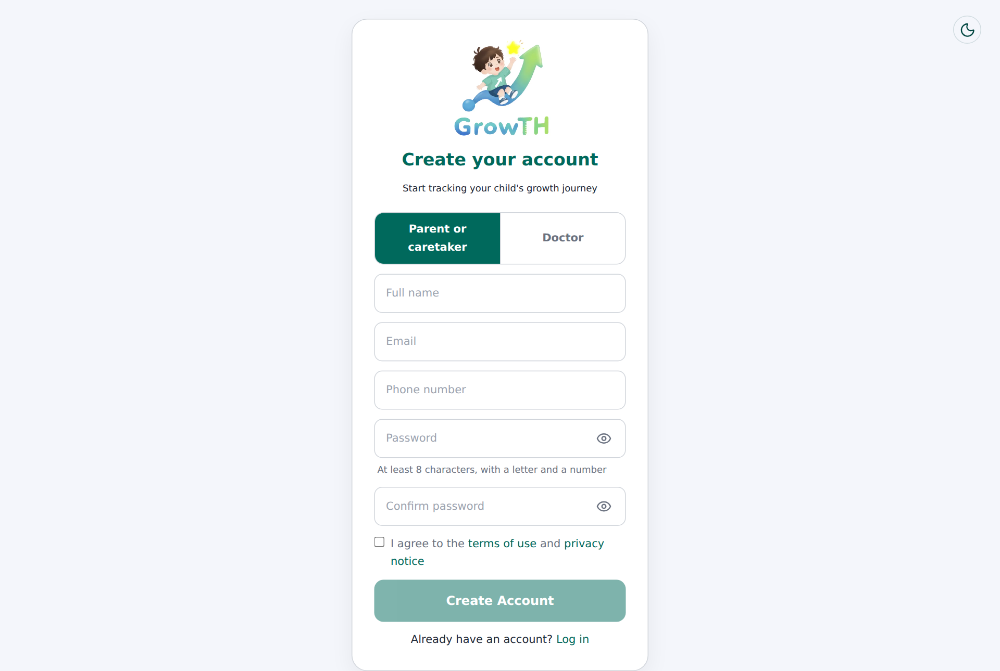

You can sign up in two ways.

**With your email address**
1. Open GrowTH and choose **Create an account**.
2. Choose **Parent or caretaker**.
3. Enter your full name, email address, phone number and a password (at least 8 characters,
   with a letter and a number).
4. Tick the box to accept the terms of use and privacy notice, and choose **Create Account**.
5. We email you a link. Open it to **confirm your email address**. Until you do, a yellow
   banner at the top of GrowTH reminds you, with a button to send the link again.

**With Google**
1. Choose **Sign up with Google** (or **Continue with Google** on the log-in page) and pick
   your Google account.
2. GrowTH fills in your name and email from Google. Choose **Parent or caretaker**, add your
   phone number, accept the terms, and choose **Create my account**. Your email is already
   confirmed, because Google has checked it.

**Both ways, one account.** If you signed up with a password and later use **Continue with
Google** on the same email address, GrowTH asks whether to link them. After linking, either
way signs you into the same account, with the same children. If you signed up with Google,
you can add a password in **Settings** (see [section 9](#9-your-account-and-settings)).

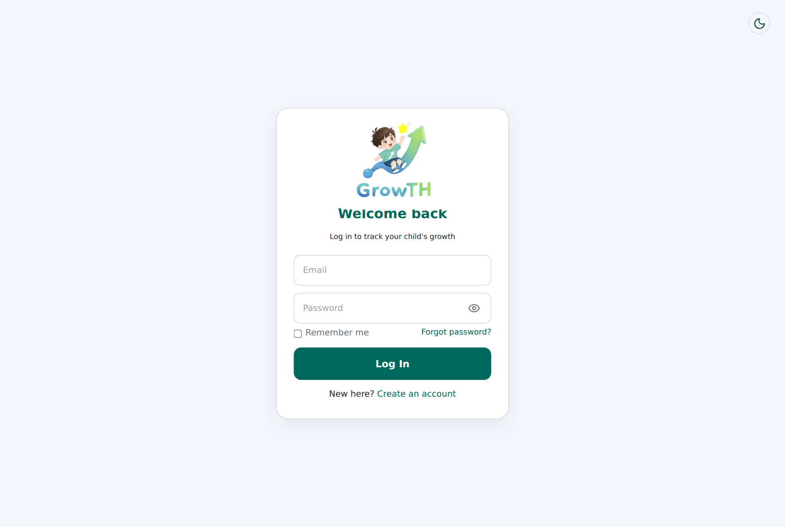

**Forgot your password?** On the log-in page choose **Forgot password?**, enter your email,
and follow the link we send (it works once, for one hour).

---

## 2. Add your child

After your first sign-in, choose **Add your own child**.

1. **Avatar.** Every child gets a drawn character instead of a photo, for their privacy.
   Babies and toddlers up to 3 years get a baby drawing; it changes to the young-child drawing
   as your child grows, by itself. Choose:
    - **Skin** tone, and **Hair** colour and style;
    - for the baby drawing, also the **Face** (eye colour, eyebrows, eyelashes and mouth) and
      **Clothes** (outfit and shoes).
2. **Full name**, and a **nickname** if you like (the charts use it).
3. **Date of birth.**
4. **Sex: Girl or Boy.** This matters: growth charts and bone age are different for girls and
   boys, so it decides which reference GrowTH compares your child with.
5. **Hospital number (HN)**, if you know it. It helps your child's doctor find them. It is
   optional and can be added later.
6. **You are this child's:** mother or father, legal guardian, or a relative raising the child
   (for example a grandparent).

The person who adds a child **manages that child's profile**. You can edit it, invite or
remove a caretaker and the child's doctor, and delete the profile. Caretakers and the doctor
join only when you invite them, and can do less (see [section 6](#6-invite-a-caretaker-or-your-childs-doctor)).

**To change any of this later,** choose the green pencil on your child's card. It opens a
window over the page you are on. Only you and the child's doctor see the pencil; the doctor can
change only the hospital number. Your answer to "You are this child's" shows on its own there;
choose **Change** to pick a different one.

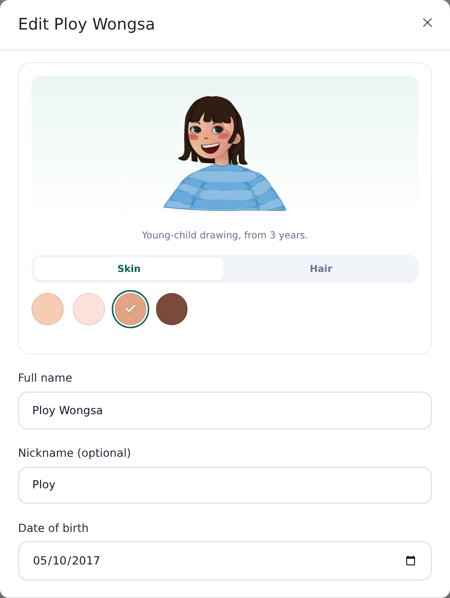

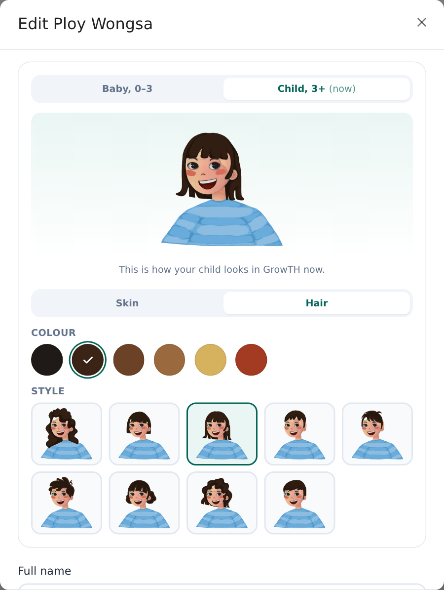

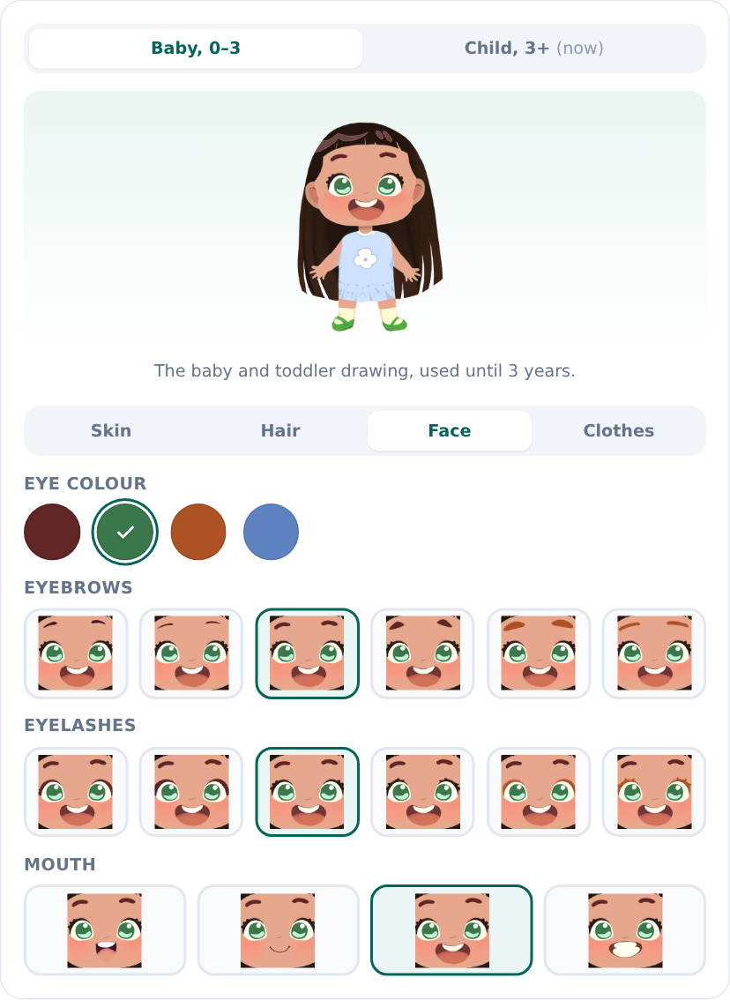

**More than one child?** Add each one the same way. Switch between them with the **switch** button (two arrows) on
the child's card; every page then shows the child you picked.

---

## 3. Your dashboard

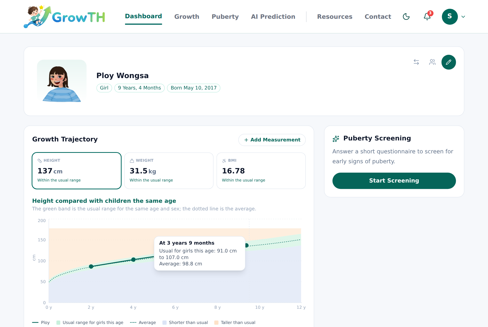

The dashboard shows the selected child at a glance:

- **The child's card** at the top, with three buttons: **switch** child (two arrows),
  **people** who follow this child and invitations (two figures), and **edit** (green pencil).
- **Height, weight and BMI** from the latest measurement (under 2 years: **height, weight and
  head size**, because BMI is only used from 2 years), each with a plain label such as
  *Within the usual range*. Choose one to see its chart below.
- **Puberty screening**: start a questionnaire, or see the latest result.
- **AI bone age**: the doctor's latest reading, when there is one.
- **Parenting resources**: short articles about growth, nutrition, puberty and bone age.

The menu at the top (at the bottom on a phone) goes to **Dashboard, Growth, Puberty, AI
Prediction, Resources** and **Contact**.

---

## 4. Record growth and read the charts

Go to **Growth**.

**Add a measurement.** Enter the height (cm) and/or weight (kg) and the date it was measured,
then choose **Add measurement**. For children under 3 you can also record head size. GrowTH
immediately tells you, in plain words, how the measurement compares with other children.

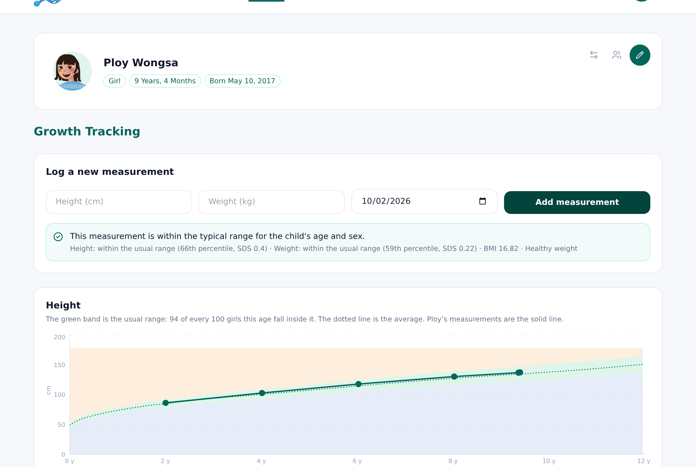

**Read the chart.**

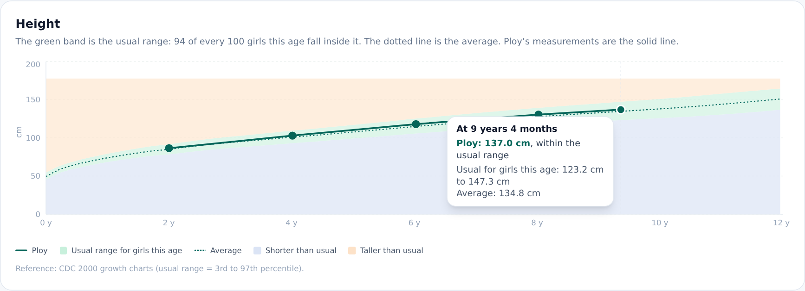

- The **solid line with dots** is your child's own measurements.
- The **green band** is the *usual range*: 94 out of every 100 children of the same age and
  sex are inside it.
- The **dotted line** is the *average*.
- The **blue area** below the band means *shorter* (or lighter) *than usual*; the **orange
  area** above means *taller* (or heavier) *than usual*.
- **Point at a dot** to see that measurement in words, for example *"At 9 years 4 months:
  137.0 cm, within the usual range. Usual for girls this age: 123.2 to 147.3 cm. Average:
  134.8 cm."*

What matters most is the **shape of the line over time**. A child who stays at a similar
place in the band is growing steadily, even if that place is near the top or the bottom. A
line that crosses into a different area, or flattens, is worth mentioning to your doctor.

**BMI** (body mass index) is shown from 2 years of age, in the colours doctors use:
underweight, healthy weight, overweight, obesity.

The reference is the CDC 2000 growth charts. The exact figures (percentile and SDS) are in
the history list: point at a *Usual / Low / High* label to see them.

**History.** Every measurement is listed under the charts. Use the **pencil** to correct one and the
**bin** to delete one.

---

## 5. Puberty screening

Go to **Puberty**. The questionnaire asks about everyday changes you might have noticed
(growing faster, outgrowing shoes, body odour, skin, and the body changes of puberty), with
questions for girls or boys. Answer **Yes**, **No** or **Not sure**.

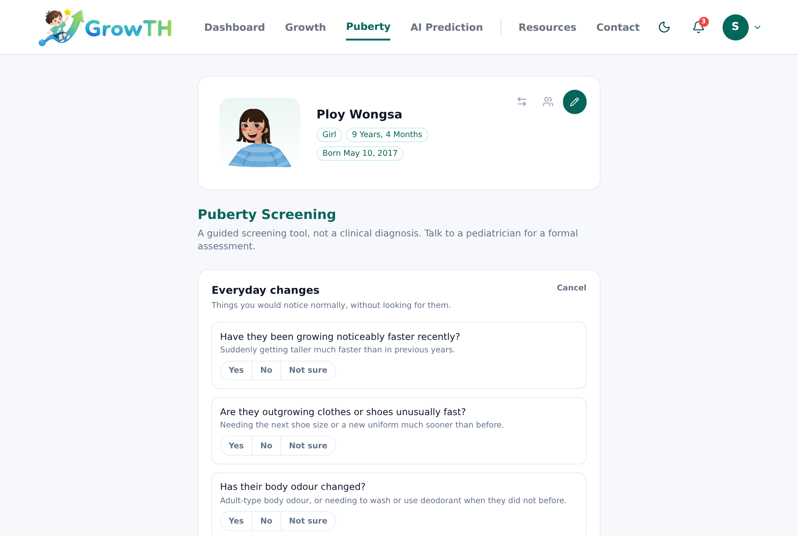

Choose **See result**. GrowTH explains what the answers suggest for your child's age and what
to do next, for example whether to talk to a doctor and when to check again.

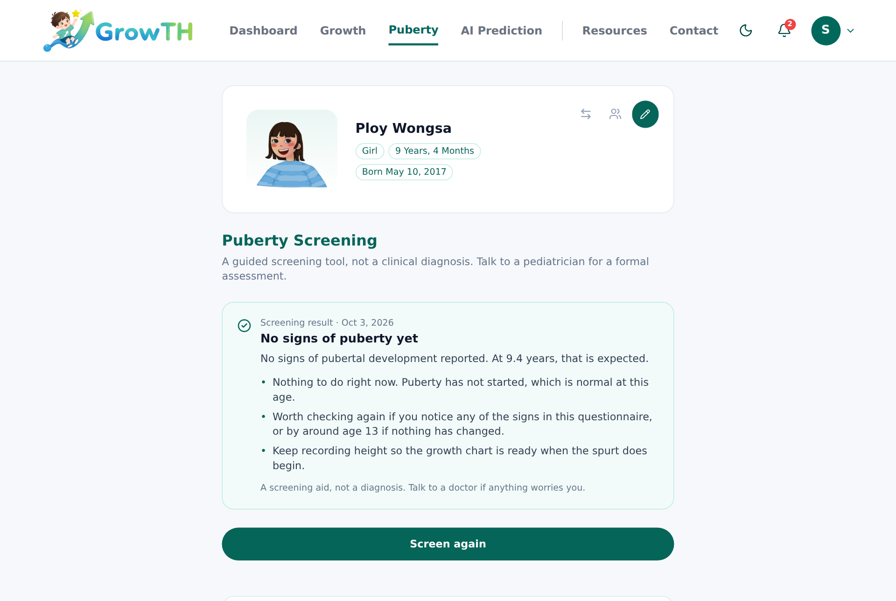

Past screenings are listed under **History**, with a follow-up plan when one is needed.

**If a caretaker fills it in,** they do not see the result. You (and the child's doctor) get
a notification, and the result appears here for you.

---

## 6. Invite a caretaker or your child's doctor

Choose the **people** button (two figures) on your child's card. A window shows who follows your child and any invitations
still waiting.

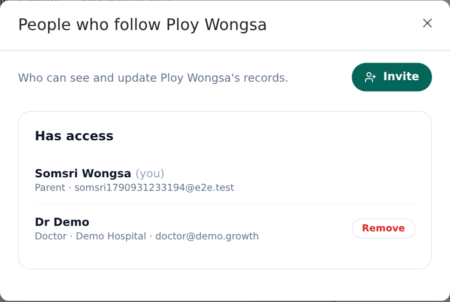

To invite someone:

1. Choose **Invite**.
2. Choose **Caretaker** (for example a nanny, teacher or relative who helps day to day) or
   **Doctor** (your child's doctor).
3. Optionally enter their **email address** and we send them the invitation. Or leave it
   empty and share the link yourself.
4. Choose **Create invitation**.

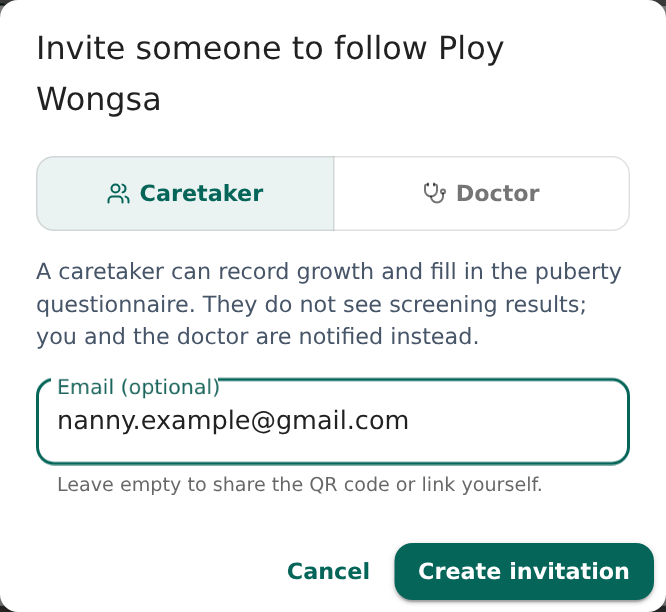

You get a **QR code** they can scan with their phone camera, and a **Copy link** button.

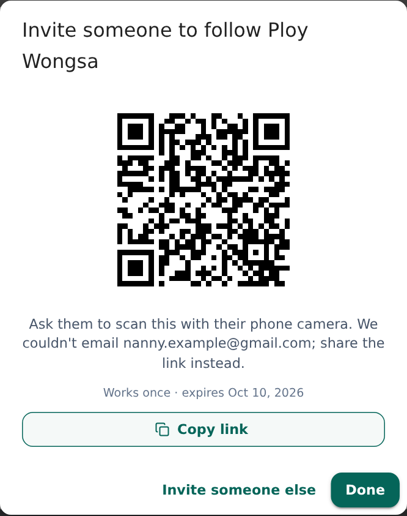

- Each invitation **works once** and **expires after 7 days**.
- You cannot invite your own email address, or someone who already follows the child.
- Inviting the same address again replaces the waiting invitation.
- To cancel an invitation that has not been used, choose the **×** next to it.
- To stop someone following your child, choose **Remove** next to their name. It takes effect
  immediately.

**What each person can do**

| | You (parent) | Caretaker | Doctor |
| --- | --- | --- | --- |
| See the child's profile and growth | ✓ | ✓ | ✓ |
| Add growth measurements | ✓ | ✓ | ✓ |
| Fill in the puberty questionnaire | ✓ | ✓ | ✓ |
| See puberty results | ✓ | – | ✓ |
| See the hospital number | ✓ | – | ✓ |
| Add hand X-rays, see the AI estimate | – | – | ✓ |
| See the doctor's bone-age reading | ✓ | ✓ | ✓ |
| Edit the profile, invite and remove people | ✓ | – | – |

A doctor needs a doctor account that GrowTH has approved before they can accept.

---

## 7. Bone age

Bone age shows how mature a child's bones are, from an X-ray of the left hand and wrist. It
can help a doctor understand growth or the timing of puberty.

In GrowTH, **only your child's doctor adds X-rays**. An AI model gives the doctor an estimate,
the doctor checks it, and then records their reading. **You see the doctor's reading, not the
AI estimate**: the date of the X-ray, *Normal for age*, *Advanced for age* or *Delayed for
age*, and the doctor's note.

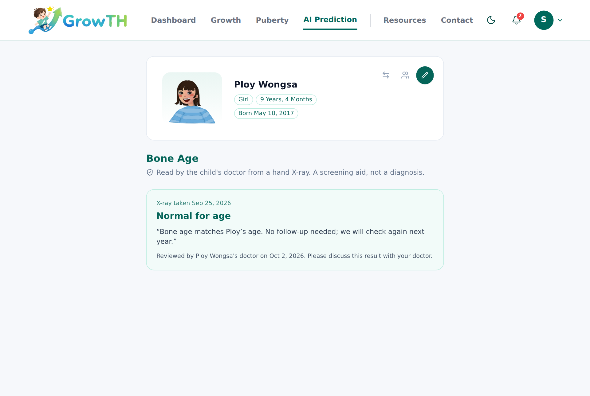

You are notified when a new reading is ready. Please discuss it with your doctor.

---

## 8. Notifications

The **bell** at the top shows a number when there is something new, for example:

- your child's routine **check-up** is due (see below);
- a caretaker filled in a puberty questionnaire;
- a bone-age reading is ready;
- someone accepted your invitation.

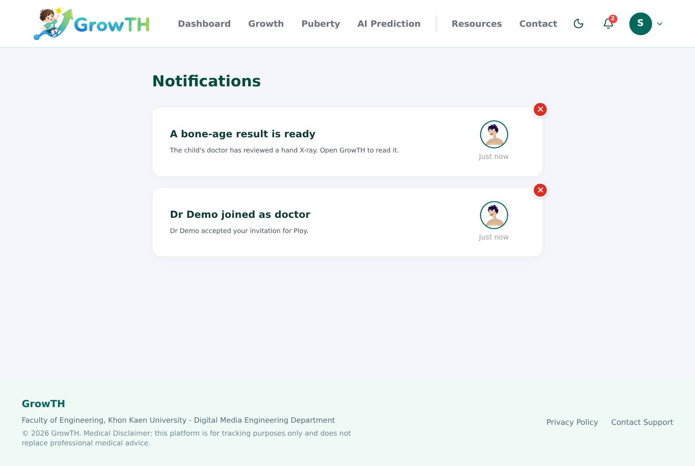

Choose a notification to open the right page for the right child. Choose the **×** to dismiss it.
Important notices are also sent by email.

**Check-up reminders.** GrowTH follows the check-up schedule of the American Academy of
Pediatrics: at 1, 2, 4, 6, 9, 12, 15 and 18 months, at 2 and 2½ years, then every year. When
your child reaches one of these ages and nothing has been measured since, you get one reminder
in GrowTH and one by email, and the dashboard shows "The … check-up is due". Book the check-up
with your child's doctor or clinic, then add the height and weight measured there; the reminder
then goes away. Each check-up is reminded only once. To stop the emails, untick **Check-up
reminders** in Settings; the reminder inside GrowTH stays.

---

## 9. Your account and settings

Open the menu under your initial (top right).

- **Profile**: your name and phone number, and **Delete account**.
- **Settings**: your profile photo and your password.

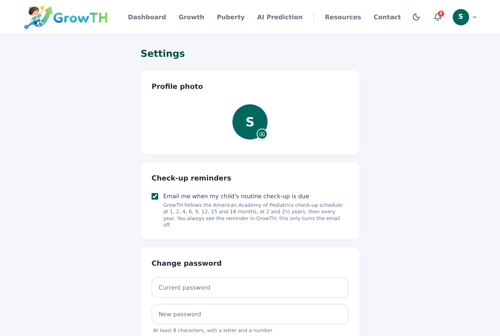

- **Change password**: enter the current one and a new one. Your other devices are signed out.
- **Add a password**: shown instead if you signed up with Google. After that you can sign in
  either way.
- **Report a problem** (also in this menu): tell the GrowTH team what went wrong. The page you
  were on is sent with it.
- **Dark mode**: the moon button in the top bar.

**Deleting your account** removes your login and photo. Any child for whom you are the only
parent is deleted too, with all their records and X-ray images. This cannot be undone.

---

## 10. Privacy: who sees what

- Your child's records are seen only by you and the people you invite, as in the table in
  [section 6](#6-invite-a-caretaker-or-your-childs-doctor).
- X-ray images are never public. Only your child's doctor can open them.
- GrowTH administrators approve doctors and answer messages; they do not see children's
  records. For research and statistics they can export figures with names, contact details,
  hospital numbers and exact dates removed.
- The full privacy notice is linked at the bottom of every page and on the sign-up page.

---

## 11. For caretakers

1. Open the invitation link or scan the QR code the parent gives you.
2. Log in, or create an account (choose **Parent or caretaker**), and choose **Accept
   invitation**.
3. The child appears on your dashboard, grouped under the parent's name if you help more than
   one family. Switch children with the **switch** button.

You can add growth measurements and fill in the puberty questionnaire. You will see
*Submitted* instead of the result: the parent and the doctor are notified and read it. You do
not see the hospital number or X-rays, and you can leave a child at any time from the switch
window (**Manage**).

---

## 12. For doctors

1. **Register as a doctor**: choose **Doctor** and enter your medical licence number and
   hospital or clinic. Confirm your email address. A GrowTH administrator checks your licence
   and approves your account; you are notified when that happens.
2. **Accept the parent's invitation** (link, QR code or email). The child appears on your
   dashboard. If the parent invited your email address, the invitation also waits on your
   dashboard under **Invitations for you**: choose **Accept**. This works once your account is
   approved, even if you opened the link earlier or did not get the email. To find a patient quickly, use the search in the switch window: it finds your
   own patients by **hospital number (HN)** or name.
3. **Add a hand X-ray**: go to **AI Prediction**, set the **exam date** (the child's age is
   taken on that date), and drop or choose the file. A **PDF report, JPEG, PNG or WebP** is
   accepted. GrowTH proposes a crop around the film (removing page margins, text or the light
   box); adjust it if needed, keeping the whole film, and choose **Upload and analyse**.

   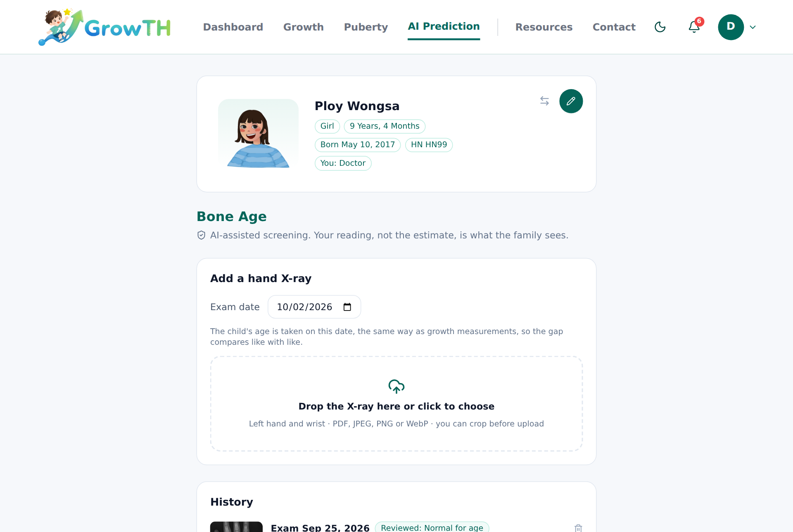

4. **Read the result.** You see the AI bone age, the child's real age on the exam day, the
   gap, and the model's typical error (about 7 months; about 1 estimate in 5 is out by more
   than a year). A gap of 2 years or more is suggested as Advanced or Delayed; a gap over 3
   years is flagged so you can check the image and dates.
5. **Record your reading**: Normal, Advanced or Delayed, an optional note for the family, and
   **Save and share with family**. Only your reading is shared, never the AI number. You can
   edit it later, and delete an X-ray.

You can also set or correct the child's hospital number with the **pencil** on the child's card.

---

## 13. Help and common questions

**I did not receive the confirmation or invitation email.** Check your spam or junk folder.
Emails come from `noreply@mail.hacklgroups.com`. In GrowTH, the yellow banner has **Send the
link again**. For invitations, the parent can also share the QR code or link directly.

**The invitation says it has expired or was already used.** Each invitation works once, for
7 days. Ask the parent to create a new one.

**I am a doctor and cannot accept the invitation.** Your doctor account must be approved
first, and your email confirmed. Wait for the approval notice, then open the link again (it
still works until it expires).

**The site is slow the first time I open it.** The server sleeps when nobody uses it and takes
up to a minute to wake. After that it is quick.

**I chose the wrong sex or date of birth.** Correct it with the **pencil** on the child's card. The charts
update at once.

**Something looks wrong.** Use **Report a problem** in the menu, or the **Contact** page.
