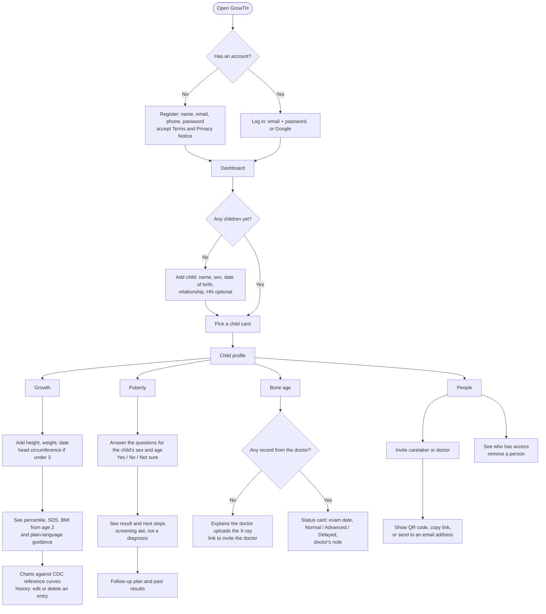
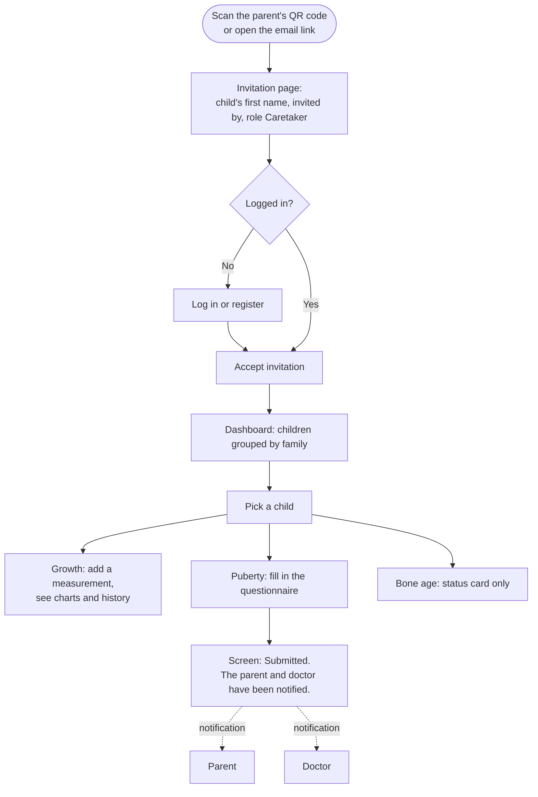
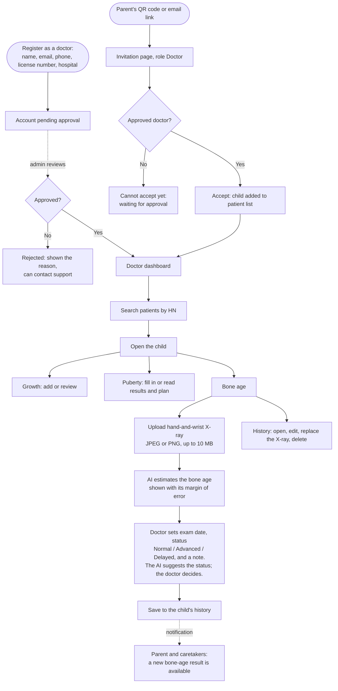
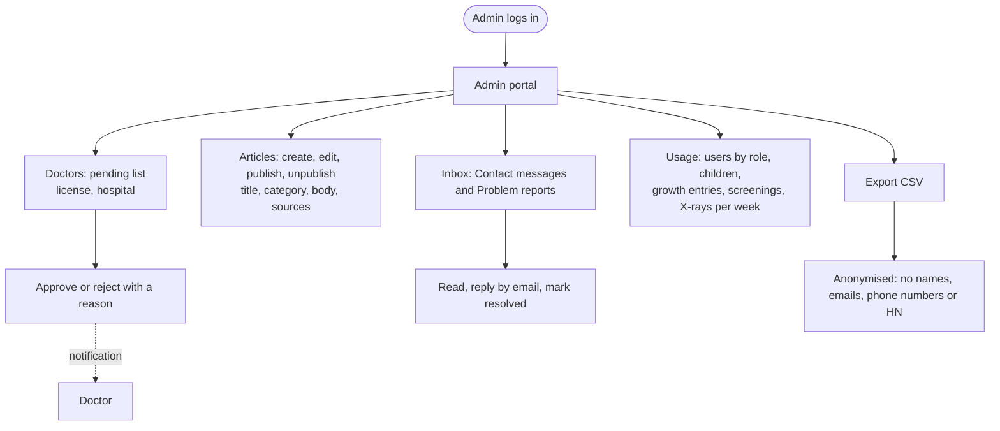
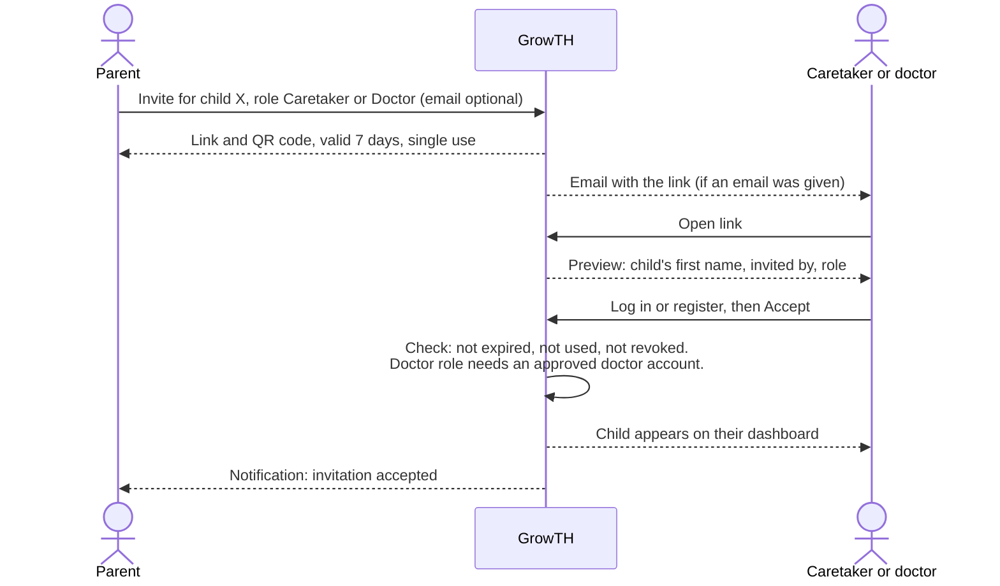

# GrowTH user flows

How each kind of user moves through GrowTH, and what each is allowed to see and do. This is the
design the backend and frontend are built against, so review it before the code. It records what
the client asked for on 2026-09-30, which differs from the TOR in places; those differences are
listed at the end.

Rendered copies of every diagram, for slides and reports, are in [`user-flows/`](user-flows/)
(SVG and PNG).

## 1. Who uses GrowTH

| User | Who they are | How they get access to a child |
| --- | --- | --- |
| **Parent** | The child's parent or legal guardian | Creates the child profile |
| **Caretaker** | Nanny, grandparent, teacher: someone who looks after the child day to day | Invited by the parent (QR code or email) |
| **Doctor** | The child's own doctor | Invited by the parent, after an admin has approved the doctor's account |
| **Admin** | GrowTH staff | Separate admin portal; never sees an individual child's record |

A person can have different roles for different children: a parent of their own child can be a
caretaker for a niece. The role belongs to the **link between a person and a child**, not to the
account. The only account-level roles are *doctor* (because it must be approved) and *admin*.

## 2. What each role can do

| For one child | Parent | Caretaker | Doctor |
| --- | --- | --- | --- |
| Create the child, edit details, delete the child | ✅ | ❌ | ❌ (can set the HN) |
| Invite a caretaker or doctor, remove people | ✅ | ❌ | ❌ |
| **Growth**: add, edit, delete measurements; see charts and history | ✅ | ✅ | ✅ |
| **Puberty**: fill in the questionnaire | ✅ | ✅ | ✅ |
| **Puberty**: see the result, past results and the follow-up plan | ✅ | ❌ sees "Submitted" only | ✅ |
| **Bone age**: upload an X-ray, run the AI, edit the record | ❌ | ❌ | ✅ |
| **Bone age**: see the result | Status only | Status only | Full |
| How they find the child | Their child cards | Child cards, grouped by family | Search by **HN** |

**"Status only"** means the parent and caretaker see:

- the exam date,
- the doctor's status: **Normal**, **Advanced** or **Delayed** for the child's age,
- the doctor's note,
- "Please discuss this result with your doctor."

They do not see the estimated bone age in months, or the X-ray itself.

**Why the caretaker cannot see puberty results:** the result is sensitive and is the parent's to
read first. When a caretaker submits a questionnaire, the parent and the doctor are notified and
read the result themselves.

These rules are enforced by the server, not only hidden in the screen: a caretaker's request for
a puberty screening comes back without the result, and a parent's request for a bone-age record
comes back without the number or the image.

## 3. Parent

## 4. Caretaker

## 5. Doctor

The AI's suggested status comes from the gap between bone age and the child's real age (two years
or more either way). That cut-off is not yet backed by a clinical source (see
`docs/product-flow.md`), which is one reason the doctor, not the AI, makes the final call.

## 6. Admin portal

An admin manages the service, not the children. The portal has no screen that opens a child's
record, and the export contains no identifying details.

## 7. Invitations

- One link can be used once. To add two caretakers, the parent creates two invitations.
- The parent can cancel an unused invitation, and remove anyone who has access.
- The preview shows only the child's first name, so a leaked link reveals as little as possible.

## 8. Notifications

| When | Who is told | How |
| --- | --- | --- |
| A caretaker submits a puberty questionnaire | Parent(s) and doctor(s) | In the app and by email |
| A doctor saves or updates a bone-age result | Parent(s) and caretaker(s) | In the app and by email |
| Someone accepts an invitation | The parent who sent it | In the app |
| An admin approves or rejects a doctor | That doctor | In the app and by email |

## 9. Edge cases

| Situation | What happens |
| --- | --- |
| Invitation expired, already used, or cancelled | Invitation page explains which, and asks the parent to send a new one |
| Doctor opens an invitation before approval | Cannot accept; told it will work once approved. The link stays valid until it expires |
| Someone opens a doctor invitation with a normal account | Told this invitation is for a doctor account |
| Parent removes the doctor | Doctor loses access immediately. The bone-age records they made stay with the child |
| Parent deletes the child | Every caretaker and doctor loses access; the records are deleted |
| Two HNs look alike | The doctor only searches their own patients, so they cannot reach another doctor's child |
| X-ray unreadable, or the model is offline | The record is saved as failed with the reason; the doctor can retry |

## 10. Where this differs from the TOR

Asked for by the client on 2026-09-30. These need the Client Representative's written agreement
and are also recorded in `docs/tor-compliance.md`.

| TOR | TOR says | Now |
| --- | --- | --- |
| FR-15 | The parent uploads the X-ray | Only the child's doctor uploads it |
| FR-13, FR-14 | The user sees the puberty result and history | Parents and doctors do; caretakers see "Submitted" only |
| FR-18 | The bone-age result is shown with its margin of error | The doctor sees the estimate and margin of error; parents and caretakers see the doctor's status |
| §4.1 | One kind of user (the parent) | Parent, caretaker, doctor, plus an admin portal |
| D7 | Application promotional video | Removed from scope by the client |
